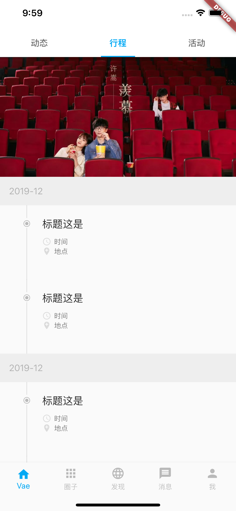
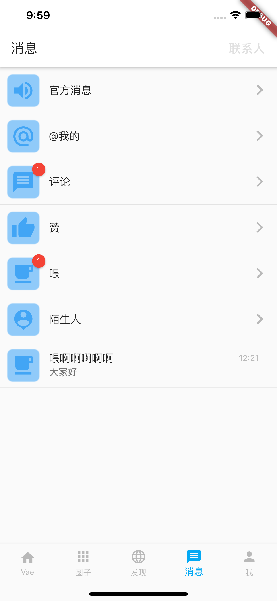
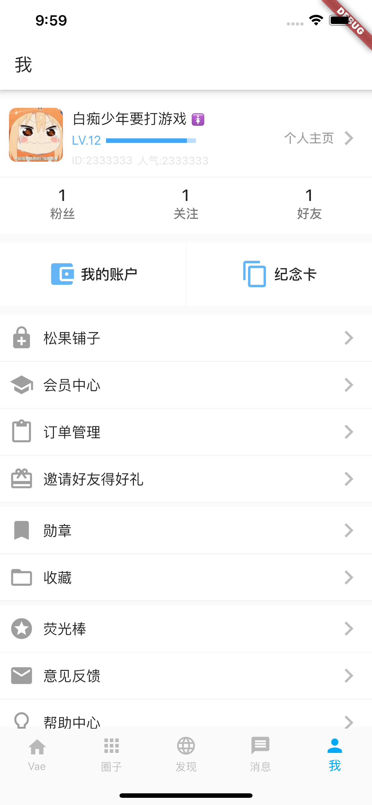

# Flutter-Vaehome

> 用Flutter构造Vae+

## 最新动态
### 该项目更新速度会较慢
> 因为根据Vae+的条款是不允许进行数据抓取 所以还没有对接接口 也放慢该项目的进度 主要根据现在版本做的样式 项目里的图片都尽量用了相似的Icon库和网络图片

### 已经完成界面

<table>
  <tbody>
    <tr>
      <td align="center" width="200" valign="top">
        
      </td>
      <td align="center" width="200" valign="top">
        
      </td>
      <td align="center" width="200" valign="top">
        
      </td>
      <td align="center" width="200" valign="top">
        
      </td>
      <td align="center" width="200" valign="top">
        
      </td>
      <td align="center" width="200" valign="top">
        
      </td>
      <td align="center" width="200" valign="top">
        
      </td>
      <td align="center" width="200" valign="top">
        
      </td>
      <td align="center" width="200" valign="top">
        
      </td>
     </tr>
  </tbody>
</table>

## 运行方式

- 运行启动您的应用
```dart
  flutter packages get
  flutter run
```
- 使用包
  - flutter_swiper : ^1.1.6
  - sticky_headers : ^0.1.8
  - photo_view : ^0.9.1
  - badges: ^1.1.0

## 开发和调试环境
用的是Mac自带的ios模拟器(Iphone 11 Pro Max)开发 安卓机调试是红米Note5;

## 新手文档参考

### [Flutter Go](https://github.com/alibaba/flutter-go/)

## 如果有其他问题,可联系交流
abigeater@163.com
