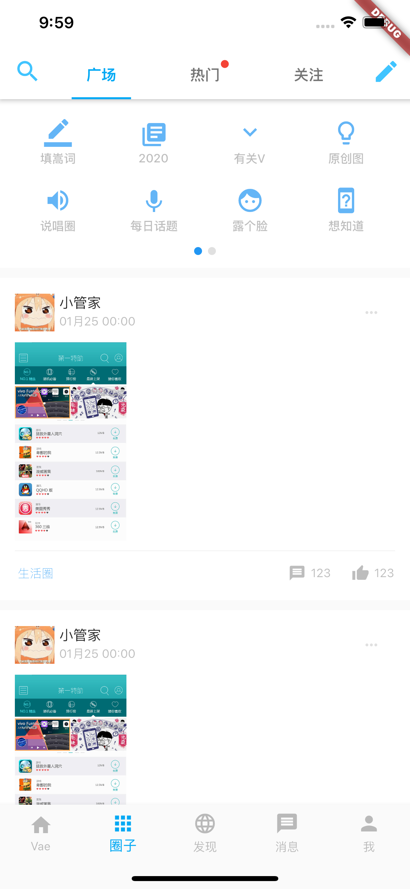

# Flutter-Vaehome

> 用Flutter构造Vae+

## 最新动态
### 该项目更新速度会较慢
> 因为根据Vae+的条款是不允许进行数据抓取 所以还没有对接接口 也放慢该项目的进度 主要根据现在版本做的样式 项目里的图片都尽量用了相似的Icon库和网络图片

<h6>完成界面：✔是1:30号为止完成的内容</h6>





## 运行方式

- 运行启动您的应用
```dart
  flutter packages get
  flutter run
```

- 如果有其他问题,请联系
  - abigeater@163.com

## 新手文档参考

### [Flutter Go](https://github.com/alibaba/flutter-go/)

## 开放和调试环境
用的是Mac自带的ios模拟器(Iphone 11 Pro Max) 安卓机调试是红米Note5;

### app 预览
